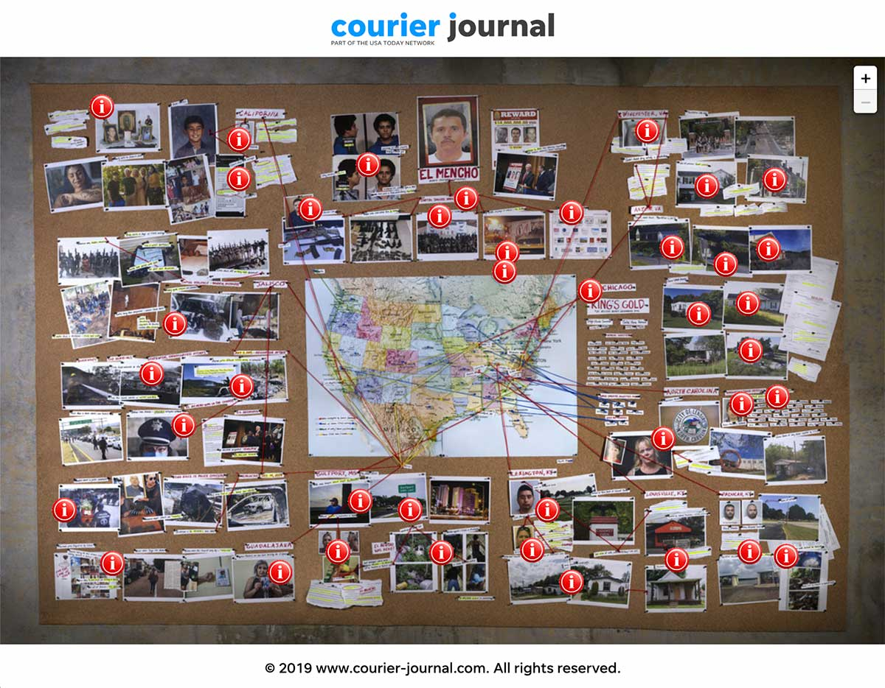

# cartel-big-wall
Project for generating the crazy wall used for the Cartel Project.



Embed here: https://content-static.courier-journal.com/embeds/cartel-big-wall/index.html

Story here: https://www.courier-journal.com/in-depth/news/crime/2019/11/24/el-menchos-mexican-drug-cartel-cjng-empire-devastating-small-towns/4181733002/

## Tech
This project was written with vanilla Javascript/CSS and the Leaflet mapping library. Asset bundling and transpilation handled by ParcelJS. We use google sheets combined with TabletopJS in order to make it easy to collaborate and edit markers and their text. https://docs.google.com/spreadsheets/d/1oydkTet9uol90mb82M9R8newrw27tiwYN7zIu1jdozE/edit?usp=sharing

## Dependencies
Required before you start.
* ParcelJS - `npm install parcel -g`
* ImageMagick - `brew install imagemagick`
* Local deps - `npm install`


## Build Steps
*Development:*
1. **Generate Maps** - `npm run generate-maps` - Uses Mapslicer to chop up the image in `raw-map/BIGWALL2.jpg` into z/y/x tiles usuable for leaflet. This only needs to be run once. **WARNING** - this will consume A LOT of resources. On a six-core Macbook Pro with 16gb of ram, the process took ~4 hours. Before even running the script, it's recommended to do a clean restart with no programs open in order to free up as much memory as possible.
2. **Serve** - `npm run serve` - Launch live reload server for development.
3. **Serve over https** - `npm run serve-secure` - Used to launch a live reload server for development with SSL. Useful for live testing the embed with in-depth tool since Presto will only accept https links.


*Production:*
1. **Generate Markers** - `npm run generate-markers` - This command will download the markers from the Google Sheet and generate `src/data.json` necessary for production.
2. **Build** - `npm run build` - Build production ready files to `dist/`.


## Collaboration mode:
In order to facillitate easy collaboration where anyone in the newsroom can add/move/edit markers on the map, we use Google Sheets as the backend. Uncomment the line in `src/js/main.js`:

```
//import collabMode from "./js/collab-mode";
``` 

This will cause the following changes when being built:
* A banner will be placed over the bottom right part of the screen to alert that this in Collab Mode and not to share the link publicly
* The app will ignore `src/data.json` and instead pull the markers directly from the google sheets document. 
* Click on the map will produce a dialog box with coordinates. Users can copy these coordinates directly into the sheet to make a new marker.
* Dragging a marker to a new location will produce a dialog box with the row number and a new set of coordinates. This is useful for anyone who wants to change the location of an existing marker.
* Clicking on a marker shows the row number in the popup. This is useful if the user wants to know where to edit the text of that marker.

Being in spreadsheet form makes it easier to for editors to do a final proof on all text in the markers. Remember to recomment or remove the line that imports the collab-mode.js script when building for production.